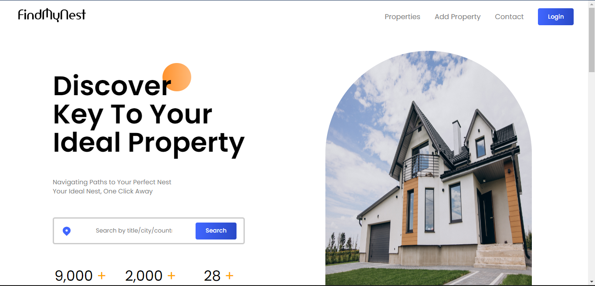

# findmynest-mern

 

 Tech Stack:

Frontend:
React: A JavaScript library for building user interfaces.
React Router: For client-side routing within the application.
Framer Motion: For creating animations and transitions.
Axios: A promise-based HTTP client for making API requests.
Auth0: For implementing user authentication and authorization.
Backend:
Node.js: A runtime environment for executing server-side JavaScript code.
Express.js: A web application framework for building APIs and handling server-side logic.
MongoDB: A NoSQL database for storing and managing application data.
Mongoose: An Object Data Modeling (ODM) library for MongoDB and Node.js.
Cloudinary: A cloud-based image and video management service.
JWT (JSON Web Tokens): For creating and managing authentication tokens.
Functionalities:

User Authentication and Authorization:

Implementing user registration, login, and logout functionality using Auth0.
Securing routes and endpoints to ensure that only authenticated users can access certain features.
Property Listings:

Displaying a list of properties available for sale or rent.
Filtering and searching properties based on user preferences.
Showcasing property details, including images, descriptions, and amenities.
Adding New Properties:

Allowing authenticated users to add new properties for listing.
Uploading property images to Cloudinary for storage and retrieval.
User Profile:

Displaying user profiles with information such as name and profile picture.
Providing the ability to edit profile details and manage properties listed by the user.
Animations and UI Enhancements:

Using Framer Motion to create visually appealing animations and transitions.
Enhancing user experience through smooth page transitions and interactive elements.
Responsive Design:

Implementing a responsive design to ensure the application works well on various devices and screen sizes.
Workflow:

Users can browse through a list of properties, view property details, and filter/search for properties based on their preferences.
Authenticated users can add new properties by providing details and uploading images.
User authentication and authorization are handled through Auth0, ensuring secure access to user-specific features.
The application utilizes a backend built with Node.js, Express.js, and MongoDB to handle data storage and retrieval.
Framer Motion animations and transitions enhance the user interface, providing a visually appealing experience.
The Cloudinary service is used for efficient storage and retrieval of property images.
Overall, Real Estate FindMyNest is a full-stack web application that allows users to explore, list, and manage properties in a user-friendly and secure environment. It leverages modern technologies to provide an engaging experience for both property seekers and property listers.

